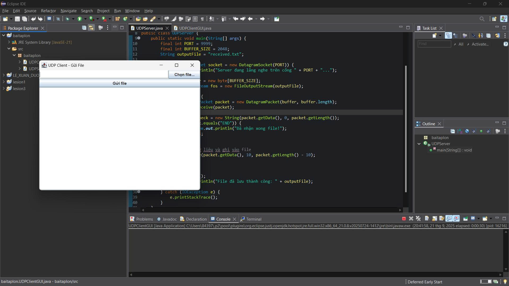
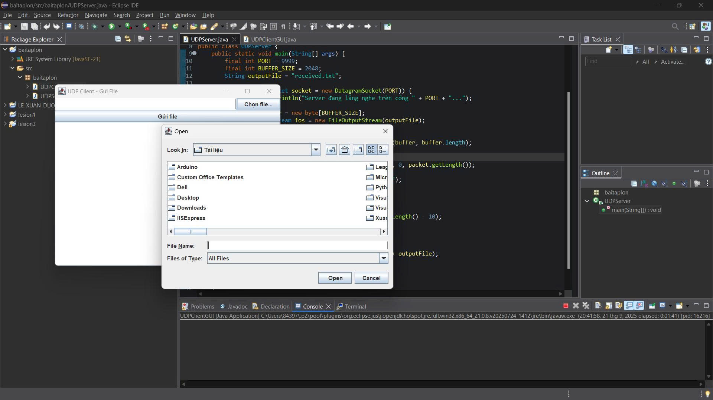
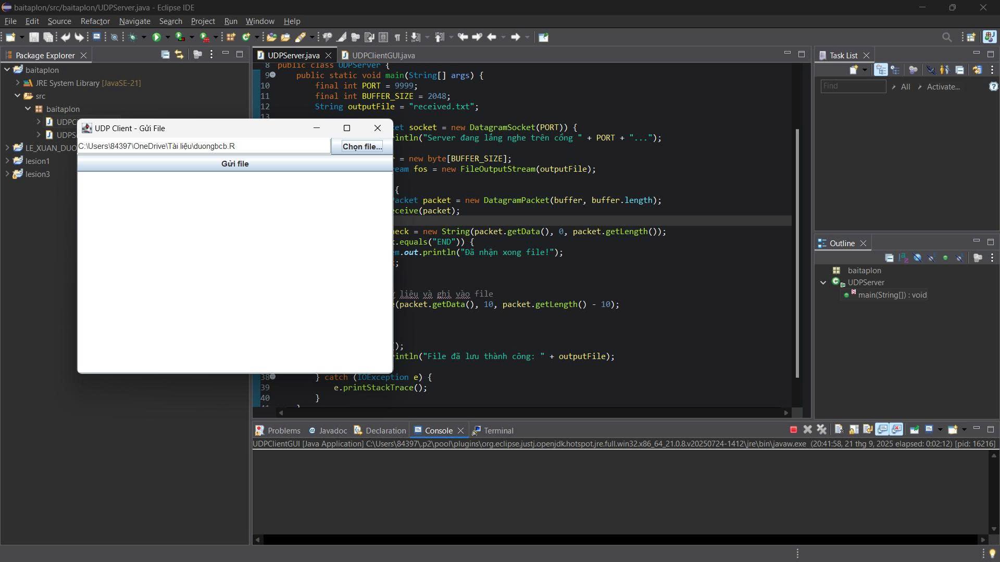
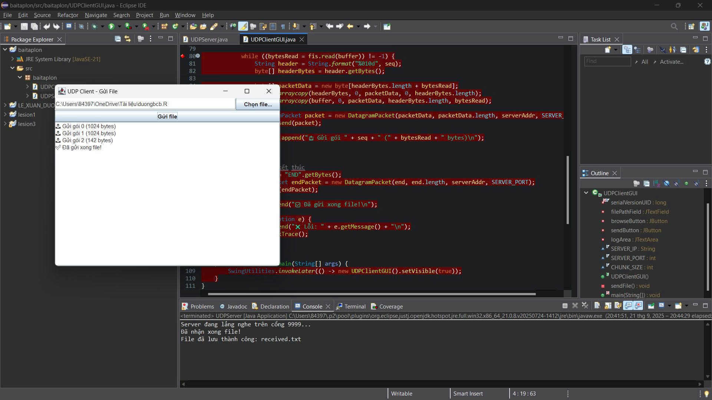
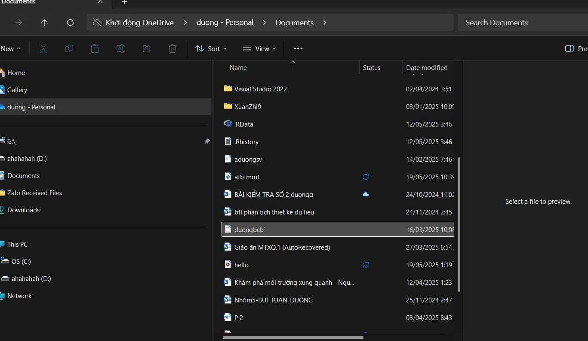

<h2 align="center">
    <a href="https://dainam.edu.vn/vi/khoa-cong-nghe-thong-tin">
    🎓 Faculty of Information Technology (DaiNam University)
    </a>
</h2>
<h2 align="center">
   TRUYỀN FILE QUA UDP
</h2>

    

        
        
        
    

## 📖 1. Giới thiệu
Giới thiệu về UDP (User Datagram Protocol)
Trong lĩnh vực mạng máy tính, UDP (User Datagram Protocol) là một trong những giao thức quan trọng thuộc tầng Transport trong mô hình TCP/IP. UDP được sử dụng để truyền dữ liệu giữa các thiết bị trong mạng một cách nhanh chóng, gọn nhẹ mà không cần quá nhiều cơ chế kiểm soát phức tạp.

🔹 Đặc điểm chính của UDP

Không kết nối (Connectionless):
Trước khi gửi dữ liệu, UDP không cần thiết lập kết nối giữa client và server như TCP. Vì vậy, việc truyền tải diễn ra nhanh hơn.

Không đảm bảo (Unreliable):
UDP không đảm bảo dữ liệu sẽ đến nơi, không kiểm tra lỗi toàn vẹn dữ liệu, không có cơ chế xác nhận gói tin đã được nhận.

Đơn giản và hiệu quả:
UDP có header chỉ 8 byte, nhỏ hơn rất nhiều so với TCP (20 byte), giúp tiết kiệm băng thông.

Truyền broadcast/multicast:
UDP hỗ trợ gửi dữ liệu tới nhiều thiết bị cùng lúc, rất hữu ích trong các ứng dụng cần phân phối dữ liệu đồng thời.

🔹 Cấu trúc gói tin UDP

Một gói tin UDP bao gồm 4 phần chính:

Source Port (16 bit): Cổng nguồn.

Destination Port (16 bit): Cổng đích.

Length (16 bit): Độ dài toàn bộ gói UDP.

Checksum (16 bit): Kiểm tra lỗi cơ bản.

🔹 Ứng dụng của UDP

UDP thường được dùng trong các ứng dụng cần tốc độ hơn độ tin cậy tuyệt đối:

Truyền phát video/audio trực tuyến (YouTube, Zoom, VoIP).

Game online (yêu cầu phản hồi nhanh, chấp nhận mất gói).

DNS (Domain Name System).

Streaming đa phương tiện, IPTV.

## 🔧 2. Ngôn ngữ lập trình sử dụng: 

## 🚀 3. Công nghệ sử dụng

  

  <em>Hình 1: Ảnh giao diện   </em>

  

  <em> Hình 2: Chọn file để truyền </em>

  

  <em> Hình 3: File được chọn và gửi </em>

  

  <em> Hình 4: Gửi thành công </em>

  

  <em> Hình 5:Kết quả </em>

## 📝 4. Hướng dẫn cài đặt và sử dụng
### 🔧 Yêu cầu hệ thống

- **Java Development Kit (JDK)**: Phiên bản 8 trở lên
- **Hệ điều hành**: Windows, macOS, hoặc Linux
- **Môi trường phát triển**: IDE (IntelliJ IDEA, Eclipse, VS Code) hoặc terminal/command prompt
- **Bộ nhớ**: Tối thiểu 512MB RAM
- **Dung lượng**: Khoảng 10MB cho mã nguồn và file thực thi
- ### 📦 Cài đặt và triển khai
### 1️⃣ Chạy Server
run as với sever để lắng nghe cổng 9999
### 2️⃣ Chạy Client
run as với client là hoàn thiện

## Nguồn
DaiNam University. 
Lê Xuân Dương - 1671020074
Gmail: lexuanduong129@gmail.com

---
